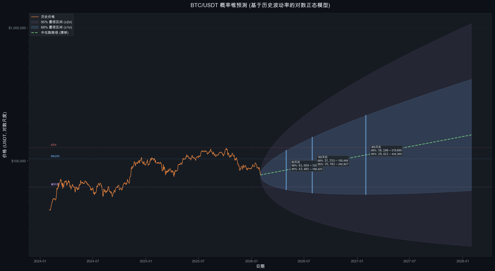

# Bitcoin Cycle Analysis


**基于币安 BTCUSDT 真实数据的比特币四年周期理论验证与预测分析**

*A data-driven validation of Bitcoin's 4-year halving cycle theory using Binance BTCUSDT historical data*

---

## Key Findings / 核心发现

| 发现 / Finding | 数据 / Data |
|:---|:---|
| 峰值时间惊人一致 Peak timing consistency | 减半后 527-546 天到达峰值，标准差仅 **9.5 天** |
| 涨幅倍数递减 Diminishing returns | 96x → 30x → 8x → **2x**，每周期衰减 ~25-30% |
| 熊市回撤收敛 Drawdown convergence | -84% → -77% → **-37%** (进行中) |
| 波动率持续降低 Declining volatility | 2025 年年化波动率仅 **41.7%**，历史最低牛市峰值年 |
| 本轮 ATH | **$126,199.63** (2025-10-06)，减半后第 535 天 |

---

## Charts Preview / 图表预览

### Price Overview / 价格走势全景


### Cycle Comparison / 周期对比


### Cycle Mapping Forecast / 周期映射预测


### Scenario Analysis / 情景分析


<details>
<summary><b>View all 18 charts / 查看全部 18 张图表</b></summary>

| # | Chart / 图表 | Preview / 预览 |
|---|---|---|
| 01 | Price Overview / 价格走势全景图 |  |
| 02 | Cycle Comparison / 减半后周期对比 |  |
| 03 | Drawdown Analysis / 历史回撤分析 |  |
| 04 | Monthly Returns Heatmap / 月度收益率热力图 |  |
| 05 | Volume Analysis / 成交量分析 |  |
| 06 | Volatility Cycle / 波动率周期分析 |  |
| 07 | 8H K-line Analysis / 8小时K线分析 |  |
| 08 | Weekly Analysis / 周K线趋势分析 |  |
| 09 | Moving Averages / 关键均线系统 |  |
| 10 | Prediction Model / 价格预测模型 |  |
| 11 | Yearly Performance / 年度表现统计 |  |
| 12 | Cycle Phase Analysis / 周期阶段划分 |  |
| 13 | Mayer Multiple / Mayer Multiple 估值 |  |
| 14 | Power Law Regression / Power Law 对数回归 |  |
| 15 | Risk Metrics Dashboard / 风险指标仪表盘 |  |
| 16 | Cycle Mapping Forecast / 周期映射预测 |  |
| 17 | Probability Cones / 概率锥预测 |  |
| 18 | Scenario Timeline / 三种情景时间线 |  |

</details>

---

## Full Report / 完整报告

See [REPORT.md](REPORT.md) for the full research report with detailed analysis.

查看 [REPORT.md](REPORT.md) 获取包含详细分析的完整研究报告。

---

## Quick Start / 快速开始

### One-command Run / 一键运行

```bash
git clone https://github.com/riba2534/bitcoin-cycle-analysis.git
cd bitcoin-cycle-analysis
pip install -r requirements.txt
./run_all.sh
```

### Step-by-step / 分步运行

```bash
# 1. Install dependencies / 安装依赖
pip install -r requirements.txt

# 2. Fetch data from Binance API / 从币安获取数据（可选，已包含数据）
python3 fetch_binance_data.py

# 3. Run main analysis, generate charts 01-12 / 主分析 + 图表 01-12
python3 analyze_btc_cycle.py

# 4. Generate pro charts 13-15 / 专业图表 13-15
python3 generate_pro_charts.py

# 5. Generate forecast charts 16-18 / 预测图表 16-18
python3 generate_forecast_charts.py
```

> The repository includes pre-generated data and charts. You can view the report directly without running any scripts.
>
> 仓库已包含预生成的数据和图表，无需运行脚本即可直接查看报告。

---

## Project Structure / 项目结构

```
bitcoin-cycle-analysis/
├── README.md                      # This file / 本文件
├── REPORT.md                      # Full research report / 完整研究报告
├── LICENSE                        # MIT License
├── .gitignore                     # Git ignore rules
├── requirements.txt               # Python dependencies
├── run_all.sh                     # One-command pipeline script
├── fetch_binance_data.py          # Step 1: Binance API data fetcher
├── analyze_btc_cycle.py           # Step 2: Main analysis + charts 01-12
├── generate_pro_charts.py         # Step 3: Pro charts 13-15
├── generate_forecast_charts.py    # Step 4: Forecast charts 16-18
├── data/                          # Raw data (~1.8MB)
│   ├── btcusdt_1d.csv             # Daily K-line (3,091 records)
│   ├── btcusdt_8h.csv             # 8-hour K-line (9,269 records)
│   ├── btcusdt_1w.csv             # Weekly K-line (441 records)
│   ├── btcusdt_1M.csv             # Monthly K-line (102 records)
│   └── statistics.json            # Computed statistics
└── charts/                        # Generated charts (~5.1MB)
    └── 01-18 PNG files            # 18 analysis charts
```

---

## Data Source / 数据来源

- **Exchange**: Binance
- **Trading Pair**: BTCUSDT
- **Date Range**: 2017-08-17 ~ 2026-02-01
- **Timeframes**: 1D / 8H / 1W / 1M
- **API**: `GET https://api.binance.com/api/v3/klines` (public, no authentication required)

---

## Disclaimer / 免责声明

> **This project is for educational and research purposes only. It does not constitute investment advice.**
>
> **本项目仅用于教育和研究目的，不构成任何投资建议。**
>
> - Historical patterns do not guarantee future results / 历史模式不保证未来结果
> - Only 3 complete halving cycles exist as sample data / 仅有 3 个完整减半周期作为样本
> - Cryptocurrency markets carry significant risk / 加密货币市场存在重大风险

---

## License

[MIT License](LICENSE) - Copyright (c) 2026 riba2534
